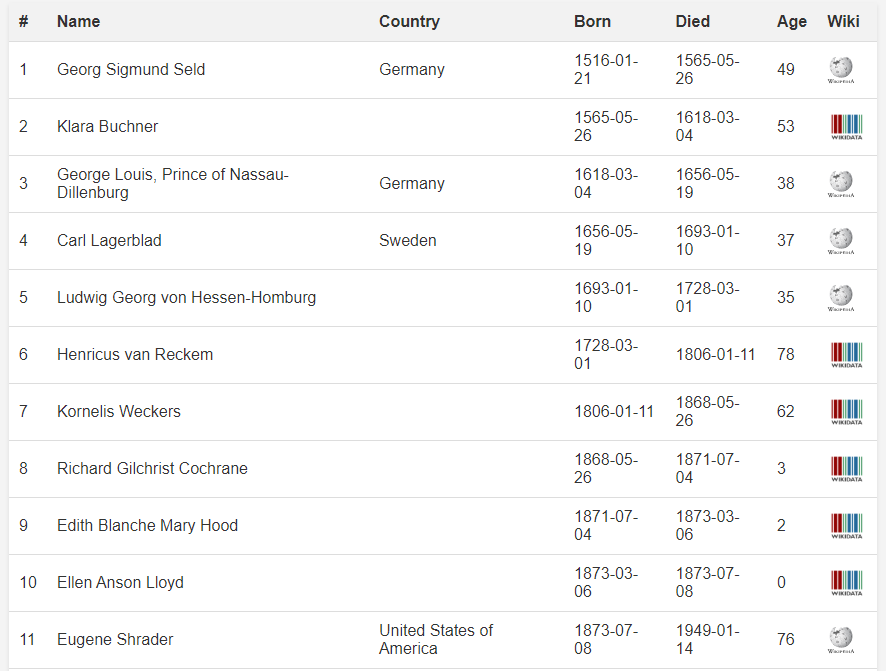

# Wikidata Incarnations


This is a silly idea.

Let us build a personal reincarnation lineage report based on the ~2 million people from <https://wikidata.org> registered with precise birth and death dates.

We will assume that reincarnation is a thing that happens in linear time and that your soul performs the jump on the day you die.
<br style="clear:both" />

## The data

The data is in a gzipped csv file: [born_and_died_slim.csv.gz](born_and_died_slim.csv.gz) (~127mb zipped/ ~475mb unzipped).

It contains 2.953.301 persons with 6 fields:

```csv
id,P569,P570,P27,label,sitelinks
```

- **id** is the wikidata id of the person, can be used to get more data from wikidata site, Q1868 would point to [https://www.wikidata.org/wiki/Q1868](https://www.wikidata.org/wiki/Q1868)
- **P569** is the birth date
- **P570** is the death date
- **P27** is country of citizenship (Q31 for Belgium)
- **label** is the name of the person (Paul Otlet)
- **sitelinks** is a json object with links to wikipedia pages in different languages

## Build lineage report

The lineage report is output as a html file that you can open in your browser and print to pdf with clickable links to wikipedia or wikidata.



### 0. Prerequisites

- Python (3.13+)
- VS Code with the Jupyter extension

Install the requirements with:

```bash
python -m venv venv
source venv/bin/activate # or  venv\Scripts\activate on windows
pip install -r requirements.txt
```

### 1. Load and clean with

Use [01_load_and_clean.ipynb](01_load_and_clean.ipynb)

It will cleanup the data save it to a new (gitignored) file: [born_and_died_slim_cleaned.csv](born_and_died_slim_cleaned.csv)

### 2. Configure reincarnation report

Use [02_single_person_lineage.ipynb](02_single_person_lineage.ipynb)

Edit you personal details in the notebook:

```python
# Define the birthday to explore
my_name = "Christian Dalager"
my_birthday = datetime(1973, 9, 20)
my_id = "christian_dalager"

skipImagePlot = True
forceImagePlotRegeneration = False
```

Creating the plot will take up to 100 minutes, so enable that flag only if you are satisfied with the rest.

### 3. Run the notebook

Still in [02_single_person_lineage.ipynb](02_single_person_lineage.ipynb), run the notebook.

Your html report will sit in the current directory with the name `christian_dalager.html` (or whatever you set `my_id` to).

If you want to customize the layout of the report, you can edit the `htmltemplate.jinja` file before generating the report. Its a fairly simple jinja2 template with some basic CSS.

## How I got the data

If you want to rebuild the dataset from scratch and add some dimensions to it or something, here is how I did it:

### 1. Get the wikipedia dump

Its big, ~130 gb zipped. Academic torrents has it. <https://academictorrents.com/browse.php?search=wikidata.org>

### 2. Filter the dump for humans with birth and death dates

Get wikibase-dump-filter from <https://github.com/maxlath/wikibase-dump-filter>

Read the documentation and you might end up with a command like this:

```bash
nice -n+19 pigz -d < wikidata-20240101-all.json.gz | grep '"Q5"' | nice -n+19 load-balance-lines wikibase-dump-filter --simplify -q --claim 'P31:Q5&P569&P570' > born_and_died.ndjson
```

It says that you should get all instances of humans (Q5) with birth and death dates (P569 and P570) and put it in a file called born_and_died.ndjson.

The result is 3.6 gb with 2.953.301 persons, one json object per line.

### 3. Trim the data by selecting born, died, country and sitelinks

Something like this:

```bash
cat .\born_and_died.ndjson | jq -c '{id:.id,P569:.claims.P569[0],P570:.claims.P570[0],P27:(.claims.P27[0] // null),label:(.labels.en // (.labels | to_entries | .[0].value)),sitelinks:.sitelinks}' > born_and_died_slim.ndjson
```

result is 650 mb

### 4. Convert ndjson to csv

I made a short python script to convert the ndjson to csv:

```bash
python convert_ndjson_to_csv.py
```

result is 450 mb, 2.953.301 rows.
